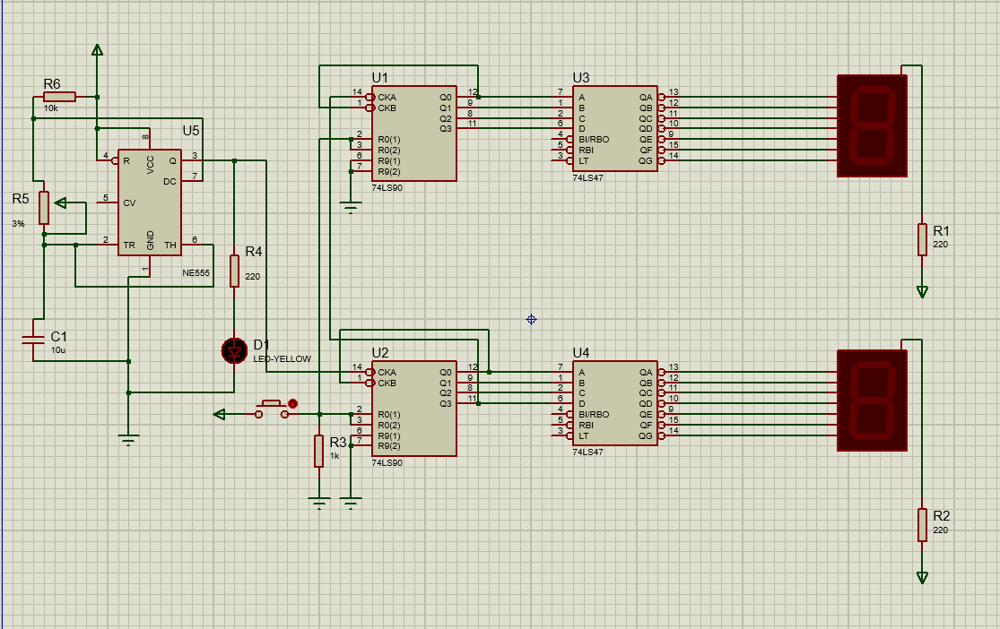
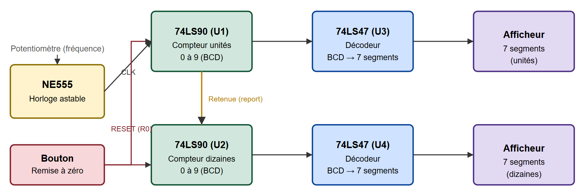
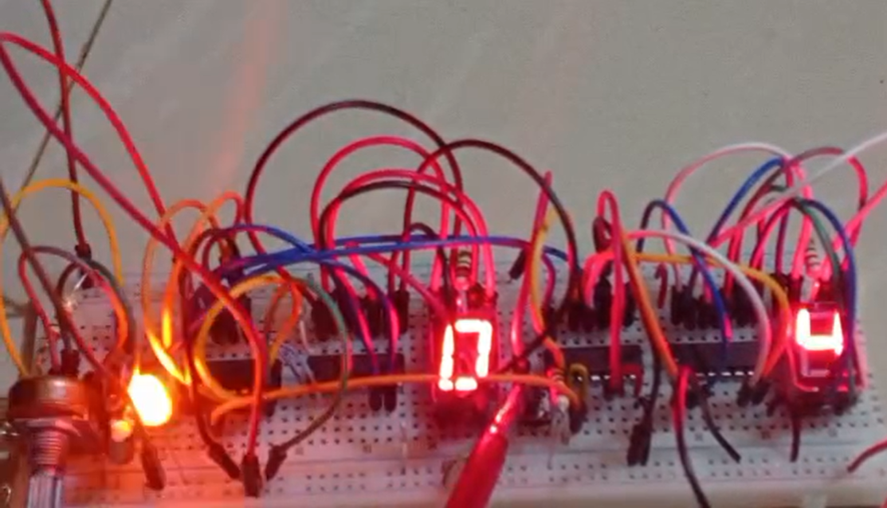

# COMPTEUR MODULO 10
### Conception d'un circuit logique

## Objectif du projet

Concevoir un compteur numérique décimal (modulo 10, de 00 à 99) avec
affichage direct sur deux afficheurs 7 segments, en utilisant des
composants logiques standards de la famille TTL. Le projet illustre
la mise en œuvre d'une horloge astable, du comptage synchrone en
cascade et du décodage BCD vers 7 segments.

## Description générale

Le montage repose sur une architecture classique de comptage
numérique :

**1. Génération de l'horloge**
Un circuit intégré NE555 (U5) est monté en astable pour générer un
signal d'horloge carré dont la fréquence est réglable grâce à un
potentiomètre (R5). Le condensateur C1 et la résistance R6 fixent la
temporisation du montage, tandis qu'une LED jaune (D1) permet de
visualiser visuellement le rythme de comptage.

**2. Comptage décimal en cascade**
Deux compteurs décimaux 74LS90 (U1 et U2) sont utilisés :
- U1 compte les unités (0 à 9)
- U2 compte les dizaines et est incrémenté par le débordement de U1
  (report de la retenue)

Cette mise en cascade permet un comptage de 00 à 99.

**3. Remise à zéro**
Un bouton poussoir, associé à la résistance de rappel R3, permet de
réinitialiser les compteurs à tout moment via les entrées
R0(1)/R0(2) des 74LS90.

**4. Décodage et affichage**
Les sorties BCD de chaque compteur sont envoyées vers un décodeur
BCD/7 segments 74LS47 (U3 pour les unités, U4 pour les dizaines),
qui pilote directement un afficheur 7 segments à anode commune. Les
résistances R1 et R2 (220 Ω) limitent le courant traversant les
segments afin de protéger les afficheurs.

## Composants principaux

| Composant | Rôle |
|---|---|
| NE555 | Générateur d'horloge astable |
| 74LS90 (x2) | Compteurs décimaux BCD |
| 74LS47 (x2) | Décodeurs BCD vers 7 segments |
| Afficheurs 7 segments (x2) | Affichage de la valeur comptée |
| Potentiomètre | Réglage de la fréquence de comptage |
| Bouton poussoir | Remise à zéro (RESET) |
| LED + résistances | Indication visuelle et protection |

## Principe de fonctionnement

À chaque front d'horloge généré par le NE555, le compteur des
unités (U1) incrémente sa valeur de 1. Lorsqu'il atteint 9 et
reçoit un nouveau front, il repasse à 0 et génère une impulsion de
retenue qui incrémente le compteur des dizaines (U2). L'ensemble
forme ainsi un compteur modulo 100 (deux compteurs modulo 10 en
cascade), avec affichage numérique en temps réel.

## Compétences mises en œuvre

- Lecture et conception de schémas électroniques
- Électronique numérique (logique combinatoire et séquentielle)
- Mise en cascade de compteurs synchrones
- Utilisation de composants logiques standards (NE555, 74LS90, 74LS47)
- Interfaçage avec afficheurs 7 segments

## Auteur

**Sèdjro Alban HINVI**
Projet personnel réalisé dans le cadre de mon apprentissage en
électronique numérique.
